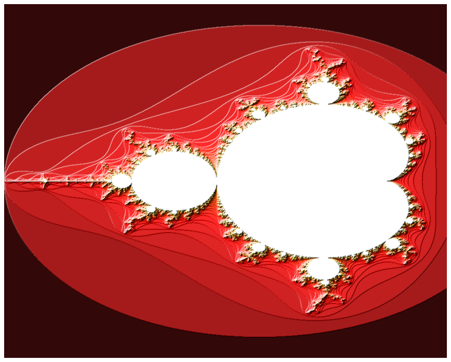

# Mandelbrot in Mojo with Python plots

Not only is Mojo great for writing high-performance code, but it also allows us to leverage the huge Python ecosystem of libraries and tools. With seamless Python interoperability, Mojo can use Python for what it's good at, especially GUIs, without sacrificing performance in critical code. Let's take the classic Mandelbrot set algorithm and implement it in Mojo.

This tutorial shows two aspects of Mojo. First, it shows that Mojo can be used to develop fast programs for irregular applications. It also shows how we can leverage Python for visualizing the results.


```mojo
#|code-fold: true
#|code-summary: "Import utilities and define `Matrix` (click to show/hide)"

from DType import DType
from Memory import memset_zero
from Object import object, Attr
from Pointer import DTypePointer, Pointer
from Random import rand
from Range import range
from TargetInfo import dtype_sizeof
from Complex import ComplexSIMD as ComplexGenericSIMD

struct Matrix:
    var data: DTypePointer[DType.f32]
    var rows: Int
    var cols: Int
    var rc: Pointer[Int]

    fn __init__(inout self, cols: Int, rows: Int):
        self.data = DTypePointer[DType.f32].alloc(rows * cols)
        self.rows = rows
        self.cols = cols
        self.rc = Pointer[Int].alloc(1)
        self.rc.store(1)

    fn __copyinit__(inout self, other: Self):
        other._inc_rc()
        self.data = other.data
        self.rc   = other.rc
        self.rows = other.rows
        self.cols = other.cols

    fn __del__(owned self):
        self._dec_rc()

    fn _get_rc(self) -> Int:
        return self.rc.load()

    fn _dec_rc(self):
        let rc = self._get_rc()
        if rc > 1:
            self.rc.store(rc - 1)
            return
        self._free()

    fn _inc_rc(self):
        let rc = self._get_rc()
        self.rc.store(rc + 1)

    fn _free(self):
        self.data.free()
        self.rc.free()

    @always_inline
    fn __getitem__(self, col: Int, row: Int) -> F32:
        return self.load[1](col, row)

    @always_inline
    fn load[nelts:Int](self, col: Int, row: Int) -> SIMD[DType.f32, nelts]:
        return self.data.simd_load[nelts](row * self.cols + col)

    @always_inline
    fn __setitem__(self, col: Int, row: Int, val: F32):
        return self.store[1](col, row, val)

    @always_inline
    fn store[nelts:Int](self, col: Int, row: Int, val: SIMD[DType.f32, nelts]):
        self.data.simd_store[nelts](row * self.cols + col, val)

    def to_numpy(self) -> PythonObject:
        let np = Python.import_module("numpy")
        let numpy_array = np.zeros((self.rows, self.cols), np.float32)
        for col in range(self.cols):
            for row in range(self.rows):
                numpy_array.itemset((row, col), self[col, row])
        return numpy_array
```

First, we introduce a `Complex` type and use it in our implementation.


```mojo
@register_passable("trivial")
struct Complex:
    var real: F32
    var imag: F32

    fn __init__(real: F32, imag: F32) -> Self:
        return Self {real: real, imag: imag}

    fn __add__(lhs, rhs: Self) -> Self:
        return Self(lhs.real + rhs.real, lhs.imag + rhs.imag)

    fn __mul__(lhs, rhs: Self) -> Self:
        return Self(
            lhs.real * rhs.real - lhs.imag * rhs.imag,
            lhs.real * rhs.imag + lhs.imag * rhs.real,
        )

    fn norm(self) -> F32:
        return self.real * self.real + self.imag * self.imag
```

Then we can write the core [Mandelbrot](https://en.wikipedia.org/wiki/Mandelbrot_set) algorithm, which involves computing an iterative complex function for each pixel until it "escapes" the complex circle of radius 2, counting the number of iterations to escape.

$$z_{i+1} = z_i^2 + c$$


```mojo
alias xmin: F32 = -2
alias xmax: F32 = 0.6
alias xn = 960
alias ymin: F32 = -1.5
alias ymax: F32 = 1.5
alias yn = 768
alias MAX_ITERS = 200

# Compute the number of steps to escape.
def mandelbrot_kernel(c: Complex) -> Int:
    z = c
    for i in range(MAX_ITERS):
        z = z * z + c
        if z.norm() > 4:
            return i
    return MAX_ITERS


def compute_mandelbrot() -> Matrix:
    # create a matrix. Each element of the matrix corresponds to a pixel
    result = Matrix(xn, yn)

    dx = (xmax - xmin) / xn
    dy = (ymax - ymin) / yn

    y = ymin
    for j in range(yn):
        x = xmin
        for i in range(xn):
            result[i, j] = mandelbrot_kernel(Complex(x, y))
            x += dx
        y += dy
    return result
```

Plotting the number of iterations to escape with some color gives us the canonical Mandelbrot set plot. To render it we can directly leverage Python's `matplotlib` right from Mojo!


```mojo
def make_plot(m: Matrix):
    np = Python.import_module("numpy")
    plt = Python.import_module("matplotlib.pyplot")
    colors = Python.import_module("matplotlib.colors")
    dpi = 64
    width = 10
    height = 10 * yn // xn

    fig = plt.figure(1, [width, height], dpi)
    ax = fig.add_axes([0.0, 0.0, 1.0, 1.0], False, 1)

    light = colors.LightSource(315, 10, 0, 1, 1, 0)

    image = light.shade(m.to_numpy(), plt.cm.hot, colors.PowerNorm(0.3), "hsv", 0, 0, 1.5)
    plt.imshow(image)
    plt.axis("off")
    plt.show()

make_plot(compute_mandelbrot())
print("finished")
```


    

    


    
    finished


## Vectorizing Mandelbrot

We showed a naive implementation of the Mandelbrot algorithm, but there are two things we can do to speed it up. We can early-stop the loop iteration when a pixel is known to have escaped, and we can leverage Mojo's access to hardware by vectorizing the loop, computing multiple pixels simultaneously. To do that we will use the `vectorize` higher order generator.

We start by defining our main iteration loop in a vectorized fashion


```mojo
fn mandelbrot_kernel_simd[simd_width:Int](c: ComplexGenericSIMD[DType.f32, simd_width]) -> SIMD[DType.f32, simd_width]:
    var z = c
    var nv = SIMD[DType.f32, simd_width](0)
    var escape_mask = SIMD[DType.bool, simd_width](0)

    for i in range(MAX_ITERS):
        if escape_mask: # All the elements have escaped, so exit.
            break
        z = z*z + c
        # Only update elements that haven't escaped yet
        escape_mask = escape_mask.select(escape_mask, z.norm() > 4)
        nv = escape_mask.select(nv, nv + 1)
    
    return nv
```

The above function is parameterized on the `simd_width` and processes simd_width pixels. It only escapes once all pixels within the vector lane are done. We can use the same iteration loop as above, but this time we vectorize within each row instead. We use the `vectorize` generator to make this a simple function call.


```mojo
from Functional import vectorize
from Math import iota
from TargetInfo import dtype_simd_width


def compute_mandelbrot_simd() -> Matrix:
    # create a matrix. Each element of the matrix corresponds to a pixel
    var result = Matrix(xn, yn)

    let dx = (xmax - xmin) / xn
    let dy = (ymax - ymin) / yn

    var y = ymin
    alias simd_width = dtype_simd_width[DType.f32]()

    for row in range(yn):
        var x = xmin
        @parameter
        fn _process_simd_element[simd_width:Int](col: Int):
            let c = ComplexGenericSIMD[DType.f32, simd_width](dx*iota[simd_width, DType.f32]() + x, y)
            result.store[simd_width](col, row, mandelbrot_kernel_simd[simd_width](c))
            x += simd_width*dx

        vectorize[simd_width, _process_simd_element](xn)
        y += dy
    return result


make_plot(compute_mandelbrot_simd())
print("finished")
```


    

    


    
    finished


## Parallelizing Mandelbrot

While the vectorized implementation above is efficient, we can get better performance by parallelizing on the rows. This again is simple in Mojo using the `parallelize` higher order function. Only the function that performs the invocation needs to change.


```mojo
from Functional import parallelize 

def compute_mandelbrot_simd_parallel() -> Matrix:
    # create a matrix. Each element of the matrix corresponds to a pixel
    var result = Matrix(xn, yn)

    let dx = (xmax - xmin) / xn
    let dy = (ymax - ymin) / yn

    alias simd_width = dtype_simd_width[DType.f32]()

    @parameter
    fn _process_row(row:Int):
        var y = ymin + dy*row
        var x = xmin
        @parameter
        fn _process_simd_element[simd_width:Int](col: Int):
            let c = ComplexGenericSIMD[DType.f32, simd_width](dx*iota[simd_width, DType.f32]() + x, y)
            result.store[simd_width](col, row, mandelbrot_kernel_simd[simd_width](c))
            x += simd_width*dx
            
        vectorize[simd_width, _process_simd_element](xn)

    parallelize[_process_row](yn)
    return result


make_plot(compute_mandelbrot_simd_parallel())
print("finished")
```


    

    


    
    finished


## Benchmarking

In this section we benchmark our sequential implementation against the parallel implementation. As you see, you get almost a 2x seedup. To get more pronounced speedups, try adjusting MAX_ITERS (e.g. 1000 or 1000) and/or the image size to (e.g. to 4096x4096).


```mojo
from Time import now
from LLCL import num_cores

print("num hardware threads:")
print(num_cores())

var eval_begin = now()
var mandelbrot_set = compute_mandelbrot_simd()
var eval_end = now()
let execution_time_sequential = F64((eval_end - eval_begin))
print("execution_time sequential in ms:")
print(execution_time_sequential / 1000000)

eval_begin = now()
mandelbrot_set = compute_mandelbrot_simd_parallel()
eval_end = now()
let execution_time_parallel = F64((eval_end - eval_begin))
print("execution_time parallel in ms:")
print(execution_time_parallel / 1000000)
print("parallel/sequential speedup:")
print(execution_time_sequential/execution_time_parallel)
```

    num hardware threads:
    8
    execution_time sequaential:
    10.306528
    execution_time parallel:
    5.394105
    parallel/sequential speedup:
    1.910702

